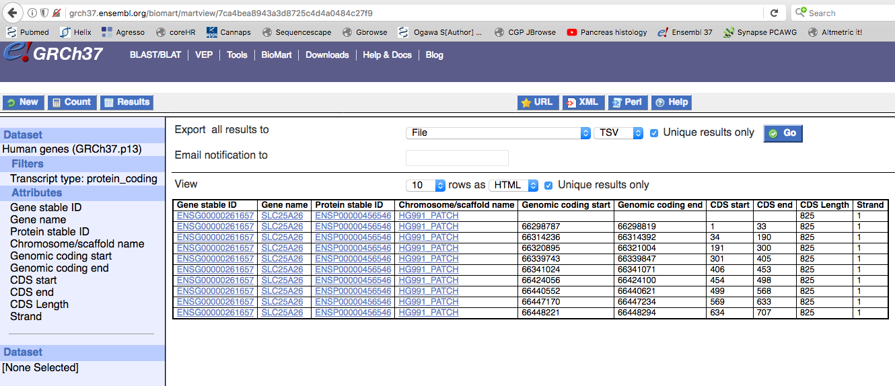

By default, **dNdScv** assumes human data with mutations mapped to the GRCh37/hg19 assembly of the human genome. Adapting the method to run with data from other species or genome assemblies requires the generation of a new reference database (RefCDS object). This tutorial explains how to use the *buildref* function provided in the latest version of the package to generate a new reference database. Users interested in analysing GRCH37/hg19 data using different transcripts to those used by default in the *dNdScv* package can also use this function to generate a bespoke RefCDS object with their transcripts of interest.

Although designed for cancer genomic studies, *dNdScv* could be also used to quantify selection in other resequencing studies, such as SNP analyses, mutation accumulation studies in bacteria or for the discovery of mutations causing developmental disorders using data from human trios.

To cite this package please use:
Martincorena I, *et al*. (2017) Universal Patterns of Selection in Cancer and Somatic Tissues. *Cell*.

###Inputs for the buildref function

As a small example, in this tutorial I show how to generate a RefCDS object for the protein coding genes in a small (500kb) segment of chromosome 3 in the GRCh37 assembly. This segment contains a few genes including *PICK3CA*. The *buildref* function needs two inputs: (1) the path to a tab-delimited table of transcripts, (2) the path to a fasta file for the reference genome of interest. 

You can find the example files using the code below to retrieve their location in your system (remember to install the latest version of the package):

```{r message=FALSE, warning=FALSE}
path_cds_table = system.file("extdata", "BioMart_human_GRCh37_chr3_segment.txt", package = "dndscv", mustWork = TRUE)
path_genome_fasta = system.file("extdata", "chr3_segment.fa", package = "dndscv", mustWork = TRUE)
```

We can first load the table of transcripts to see the input format required by *buildref*.

```{r message=FALSE, warning=FALSE}
reftable = read.table(path_cds_table, header=1, sep="\t", stringsAsFactors=F)
print(reftable[1:21,])
```

The input table of transcripts is a tab-delimited text file. Each row corresponds to an exon (in the case of genes with multiple exons) or to a whole CDS (in the absence of introns):

1. **Gene ID**: This column is only used for annotation purposes (it does not need to be a recognised gene ID).
2. **Gene name**: This is the gene name that dNdScv will use. If multiple transcripts with the same gene name are provided, *buildref* will use the longest coding CDS as the reference CDS for dNdScv. If you want to use more than one transcript for a given gene in dNdScv, make sure to assign a different name to each using this column.
3. **CDS ID**: This should be a unique identifier for each transcript. The default RefCDS in *dNdScv* uses the Ensembl protein ID.
4. **Chromosome name**: Note that chromosome names and coordinates must be consistent with the input reference fasta file provided.
5. **Chromosomal start**: Starting coordinate (1-based) of the exon.
6. **Chromosomal end**: End coordinate (1-based) of the exon.
7. **CDS start**: First coding base of the exon.
8. **CDS end**: Last coding base of the exon.
9. **Length**: Full length of the CDS for this transcript (this is used to identify the longest coding CDS for each gene).
10. **Strand**: Coding strand of the transcript.

The *buildref* function was originally designed to use a table of transcripts from Ensembl BioMart as input. You can use the [BioMart website](https://www.ensembl.org/biomart/martview/) to download all coding transcripts from a given genome assembly for a wide range of species. Withing BioMart, click on the "Ensembl genes" database and choose your species of interest. Then use the "Attributes" menu on the left and the "Structures" option (exon-level information) to select the 10 columns needed by *buildref*. Make sure that your table has all 10 columns in the right order (see example image below). Using BioMart will generate a large tsv table with multiple transcripts per gene. *buildref* will choose the longest complete coding sequence per gene. *buildref* currently also discards transcripts with ambiguous bases (e.g. "N"). However, if you are interested in particular transcripts, you can edit the table to contain only one transcript of interest per gene. If you would like *dNdScv* to use more than one transcript for some genes with very different alternative transcripts, such as *CDKN2A*, you can assign a different gene name for each transcript of interest (e.g. *CDKN2A-1*, *CDKN2A-2*).



Although the *buildref* function was originally designed to use BioMart output tables and fasta files of whole genome assemblies, you can use it in more flexible ways. For example, you could provide a fasta file with a CDS sequence per entry instead of full chromosomes, or you could annotate different protein domains under a different "gene name" to perform inferences of selection at a domain level. Just note that, since dNdScv uses substitution models in a trinucleotide context, buildref will need to access the base before and after each CDS in the input fasta file.

###Using buildref

```{r message=FALSE, warning=FALSE}
library(dndscv)
path_cds_table = system.file("extdata", "BioMart_human_GRCh37_chr3_segment.txt", package = "dndscv", mustWork = TRUE)
path_genome_fasta = system.file("extdata", "chr3_segment.fa", package = "dndscv", mustWork = TRUE)
buildref(cdsfile=path_cds_table, genomefile=path_genome_fasta, outfile = "example_output_refcds.rda")
```

The code above will generate a RefCDS object and save it as a file using the *outfile* file name. Some users may be interested in loading the object and examining its structure (```load("example_output_refcds.rda"); print(RefCDS[[1]])```). The RefCDS object is an array of lists with an entry per gene (or, strictly speaking, per unique gene name). It contains information on the sequence of the gene and a table (192 rows by 4 columns) with the precomputed impact of all possible coding mutations in the gene and their trinucleotide context.

###Running dNdScv with a new RefCDS object

We can use the simulated breast cancer data provided with the package to test the new RefCDS object that we have generated above. In the example, the reference fasta file was only a segment of chromosome 3 (3:178800000-179300000) and the gene coordinates in the transcript table had been adjusted accordingly. Thus, we need to correct the position of the mutations in the example file for consistency with the new RefCDS object.

```{r message=FALSE, warning=FALSE}
library("dndscv")
segment = c(178.8e6,179.3e6) # The 500kb segment of the genome used to generate the new RefCDS
data("dataset_simbreast", package="dndscv") # Example dataset
mutations = mutations[mutations$chr=="3" & mutations$pos>segment[1] & mutations$pos<segment[2], ] # Restricting the mutations to those inside the segment
mutations$pos = mutations$pos-segment[1]+1 # Correcting the position of the mutations to their position in the reference fasta file used
dndsout = dndscv(mutations, refdb="example_output_refcds.rda", cv=NULL)
print(dndsout$sel_cv) # This is shown as an example but these results based on a few genes should not be trusted
```

###Running *dNdScv* with and without covariates

Using *cv=NULL* we are telling *dndscv* not to use the default covariates provided with the package. As explained in the original publication (Martincorena *et al.*, 2017), *dNdScv* can use covariates to reduce the uncertainty in the variation of the mutation rate across genes. Covariates can improve the performance of the model by increasing its sensitivity and specificity, although their impact can be small. 

You can see the impact of covariates in the example dataset provided using the code below. Note that we are now using the default RefCDS and running this analysis considering all genes in the genome:

```{r message=FALSE, warning=FALSE}
data("dataset_simbreast", package="dndscv")
dndsout = dndscv(mutations)
dndsout_nocovariates = dndscv(mutations, cv=NULL)
print(dndsout$sel_cv[dndsout$sel_cv$qglobal_cv<0.1, c("gene_name","qglobal_cv")])
print(dndsout_nocovariates$sel_cv[dndsout_nocovariates$sel_cv$qglobal_cv<0.1, c("gene_name","qglobal_cv")])
```

In the example dataset, only one gene is lost from the list of significant genes when running dNdScv without covariates. However, this is only a simulated dataset and does not necessarily reflect the likely gains of using covariates in real datasets. The benefits of using covariates can be larger in datasets with larger unexplained variation of the mutation rates across genes and so users may want to generate their own covariates for a new RefCDS object. By default, in the original publication I used chromatin information from Epigenomics RoadMap to generate 20 covariates for GRCh37. Other useful covariates can be sequencing coverage or expression level, for example. Those users interested in trying their own covariates can see the input format by loading the default covariates used by *dNdScv*:

```{r message=FALSE, warning=FALSE}
data("covariates_hg19", package="dndscv")
print(covs[1:5,])
```

Covariates need to be formatted as a numeric matrix with all genes as rows (use row.names=*gene_names*) and a column per covariate. By default, a maximum of 20 covariates are used, but users can change this with the *maxcovs* argument in the dndscv function. You can also see the impact of different covariates by exploring the regression output (```dndsout$nbreg``` and ```dndsout$nbregind``` for substitutions and indels, respectively).

When using a new RefCDS, please exercise caution in interpreting the results. For example, low values of theta (e.g. ```dndsout$nbreg$theta``` << 1) indicate that there is large unexplained variation in the mutation density across genes and may mean that *dNdScv* is not adequate for this dataset.

###Precomputed RefCDS objects for some species

I have generated precomputed RefCDS objects for a few species and you can find them in this [link](https://github.com/im3sanger/dndscv_data/tree/master/data). Please use these with caution as they have not been tested extensively.

If you have generated a new RefCDS object and/or covariates for an interesting species and would like to share it with other users, please drop me an [email](https://www.sanger.ac.uk/people/directory/martincorena-inigo).

###References
* Martincorena I, *et al*. (2017) Universal Patterns of Selection in Cancer and Somatic Tissues. *Cell*. 171(5):1029-1041.
